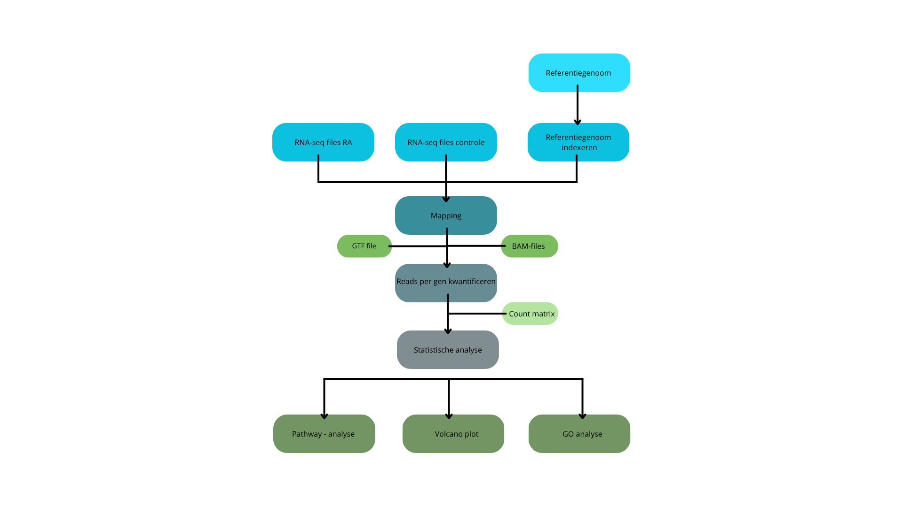

# Genexpressieanalyse laat zien dat reumatoïde artritis afwijkt van gezonde toestand

## Inleiding

Rheumatoïde artritis is een chronische auto-immuunziekte die wordt gekenmerkt door ontsteking van de gewrichten. Deze ontstekingen kunnen leiden tot blijvende gewrichtsschade en verminderde functionaliteit. De exacte oorzaak van reuma is nog niet volledig bekend [1]. Maar vermoedelijk is het een gevolg van een combinatie van genetische factoren, omgevingsfactoren én een verstoord immuunsysteem. 
Omdat er momenteel geen genezing bestaat voor reuma is het belangrijk om meer inzicht te krijgen in het moleculaire mechanisme van de ziekte. Transcriptomics biedt mogelijkheid om genexpressiepatronen te analyseren en een verschil tussen gezond en ziek weefsel te identificeren [2]. Hierdoor kunnen betrokken genen en pathways worden getraceerd. In deze analyse wordt RNA-sequentie data geanalyseerd van patiënten met reuma en controles zonder reuma. Het doel van deze analyse is om differentieel tot expressie gebrachte genen te identificeren en te onderzoeken welke Gene Ontology-termen en KEGG pathways betrokken zijn bij de ziekte. De volledige tekst van dit document is terug te vinden in de README van deze [README](https://github.com/Naomi-cell-jello/Transcriptomics) repository. De ruwe data is beschikbaar via hier: [ruwe data](data_RA_raw)

## Inhoud/structuur

- `Data_RA_raw` - datasets voor de analyse
- `Casus R` - verwerkte datasets gegenereerd met scripts 
- `Figuren/` - grafieken
- `bronnen/` - gebruikte bronnen 
- `README` - het document om de tekst hier te genereren
- `Data_stewardship` - aantoning van de competentie beheren

## Methode

In dit onderzoek werd RNA-seq data geanalyseerd van in totaal acht weefsels, afkomstig van vier gezonde controles en vier patiënten met rheumatoïde artritis. De ruwe sequencing reads werden eerst gemapt naar het humane referentiegenoom (GRch38) met behulp van het Rsubread (versie 2.24.0) package in R. Vervolgens werd met featureCounts het aantal reads per gen bepaald, wat resulteerde in een count matrix. 

Differentiële genexpressie tussen de controlegroep en de RA-groep werd geanalyseerd met behulp van het DESeq2 (versie 1.50.2) package. Hierbij werden genen met aangepaste p-waarde (padj) <0.05 als significant beschouwd. Om betekenis te geven aan de tot expressie gebrachte genen, werd een Gene Ontology (GO) analyse uitgevoerd met behulp van clusterProfiler (versie  4.18.4) [3]. Hiermee konden genen worden gegroepeerd op basis van hun betrokkenheid bij biologische processen. Daarnaast werd een KEGG pathway analyse uitgevoerd om inzicht te krijgen in welke signaalroutes en pathways betrokken zijn bij reuma. Het flowschema van de analyse is weergegeven in figuur 1. 

**Figuur 1. Flowschema.** Overzicht van de RNA-seq analyse. De figuur toont de stappen van referentiegenoom-indexeren en mapping van de RNA-seq reads tot statistische analyse.

## Resultaten

De differentiële genexpressie analyse met behulp van DESeq2 toonde aan dat er duidelijke verschillen bestaan in genexpressie tussen patiënten met reumatoïde artritis en gezonde controles. Een groot aantal genen werd significant verschillend tot expressie gebracht (padj < 0.05), wat zichtbaar is in de volcano plot (Figuur 2). 

**Figuur 2. Volcano plot differentiële genexpressie.** De plot toont de log2 fold change tegenover de aangepaste p-waarde (padj) 
voor alle genen. Significant op- en neer gereguleerde genen zijn zichtbaar, 
wat wijst op duidelijke verschillen in genexpressie tussen reumatoïde artritis 
en controle samples.

Zowel opgereguleerde als neergereguleerde genen werden geïdentificeerd, wat wijst op veranderingen in verschillende biologische processen.
De Gene Ontology (GO) analyse liet zien dat de differentieel tot expressie gebrachte genen voornamelijk betrokken zijn bij immuun-gerelateerde biologische processen. De meest verrijkte processen omvatten onder andere leukocyte mediated immunity, lymphocyte mediated immunity, T-cell differentiation en B-cell activation (Figuur 3). 

**Figuur 3. Verrijking GO-proces bij reumatoïde artritis.** De plot toont de meest verrijkte biologische processen gebaseerd op differentieel tot expressie gebrachte genen tussen reumatoïde artritis en controlegroepen. Opvallend is dat vooral immuun-gerelateerde processen verrijkt zijn, zoals leukocyten- en lymfocyten-gemedieerde immuniteit, T-cel differentiatie en B-cel activatie. Dit wijst op een verhoogde activiteit van het immuunsysteem, wat kenmerkend is voor reumatoïde artritis.

Deze processen wijzen op een verhoogde activiteit van zowel het aangeboren als het adaptieve immuunsysteem.
De KEGG pathway analyse bevestigde deze bevindingen door de identificatie van relevante immuun-gerelateerde pathways [4], zoals cytokine–cytokine receptor interaction en de JAK-STAT signaling pathway (Figuur 4).

**Figuur 4. Kegg pathway plot.** Deze plot toont de meest verrijkte pathways. Immuun-gerelateerde pathways 
zoals cytokine signaling en de JAK-STAT signaling pathway zijn prominent 
aanwezig. De pathway olfactory transduction wordt ook weergegeven. Deze wordt beschouwd als irrelevant. 

Deze processen zijn geassocieerd met activatie van zowel het aangeboren als het adaptieve immuunsysteem [3]. Daarnaast werd ook de pathway olfactory transduction sterk gevonden. Deze pathway is gerelateerd aan reukreceptoren en is niet relevant voor reumatoïde artritis. De verschijning van deze pathway in de analyse is verklaarbaar door de grote hoeveelheid olfactory receptor genen in het genoom [5]. 
Gezamenlijk tonen deze resultaten aan dat veranderingen in genexpressie bij reumatoïde artritis voornamelijk gerelateerd zijn aan immuunactivatie en ontstekingsprocessen.

## Conclusie
De RNA-seq analyse van gewrichtslijmvlies van patiënten met reumatoïde artritis en gezonde controles heeft aangetoond dat er duidelijke verschillen bestaan in genexpressie tussen beide groepen. Een groot aantal genen werd significant differentieel tot expressie gebracht, wat wijst op veranderingen in verschillende biologische processen.
De GO-analyse liet zien dat vooral immuun-gerelateerde processen verrijkt zijn, zoals leukocyten- en lymfocyten-gemedieerde immuniteit, T-cel differentiatie en B-cel activatie. Deze bevindingen benadrukken de centrale rol van het immuunsysteem bij het ontstaan en de progressie van reumatoïde artritis en komen overeen met eerder onderzoek [6].
De KEGG pathway analyse bevestigde deze resultaten door de identificatie van belangrijke immuun-gerelateerde pathways, zoals cytokine signaling en de JAK-STAT signaling pathway. Hoewel ook niet-relevante pathways zoals olfactory transduction naar voren kwamen. 
Voor vervolgonderzoek wordt aanbevolen om strengere filtering van genen toe te passen en meerdere datasets te analyseren om de betrouwbaarheid van de resultaten te vergroten [7].

## Referentie 
[1][Bronnen-Xiong et al2019.pdf](https://github.com/user-attachments/files/28348950/Bronnen-Xiong.et.al2019.pdf)
[2][Bronnen-Olender et al.2008.pdf](https://github.com/user-attachments/files/28348954/Bronnen-Olender.et.al.2008.pdf)
[3][Bronnen-Carbon et al2020d.pdf](https://github.com/user-attachments/files/28348688/Bronnen-Carbon.et.al2020d.pdf)
[4][Bronnen-Yu et al2022b.pdf](https://github.com/user-attachments/files/28348735/Bronnen-Yu.et.al2022b.pdf)
[5][Bronnen-Niimura2012.pdf](https://github.com/user-attachments/files/28348859/Bronnen-Niimura2012.pdf)
[6][Bronnen-Platzer et al2019b.pdf](https://github.com/user-attachments/files/28348881/Bronnen-Platzer.et.al2019b.pdf)
[7][Bronnen-Leek2012.pdf](https://github.com/user-attachments/files/28348925/Bronnen-Leek2012.pdf)

